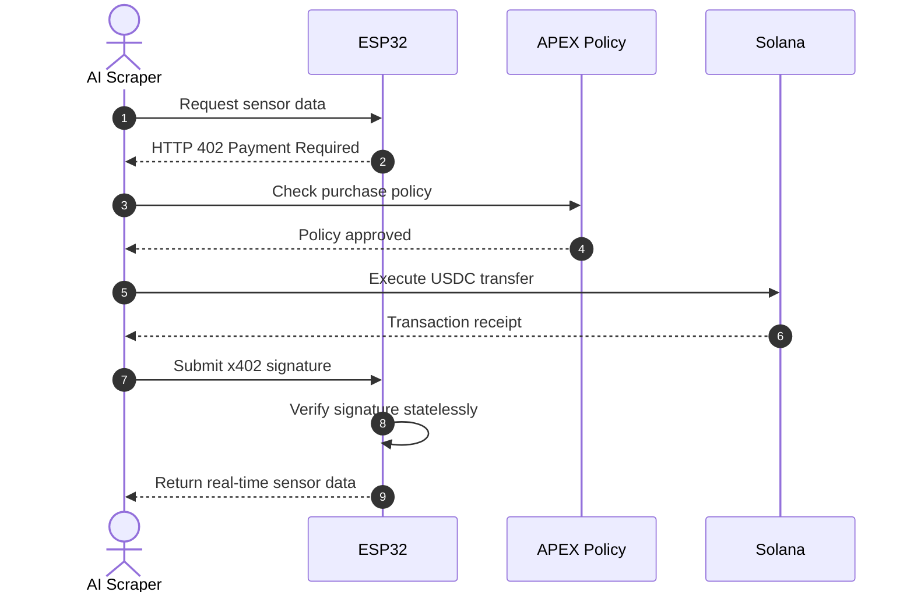
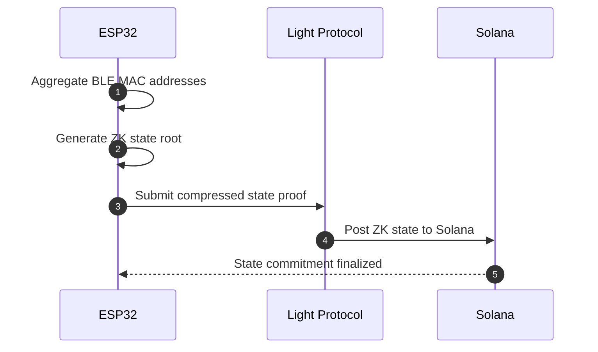

<div align="center">

# VENDX

**Turn a $5 ESP32 into a self-sovereign economic actor.**

Sensors sell their own telemetry to AI agents over [x402](https://github.com/x402-foundation/x402) on Solana — HTTP 402, USDC micropayments, ZK-compressed history.

[Live demo](https://web-rouge-six-46.vercel.app) · [Architecture](docs/ARCHITECTURE.md) · [Protocol](docs/PROTOCOL.md) · [Runbook](docs/RUNBOOK.md)

</div>

---

An AI scraper asks an ESP32 for sensor data. The device answers `402 Payment
Required`. The agent checks its own spend policy, pays USDC on Solana, and
replays the proof. The device verifies it in ~40ms and dispenses the data.
Historical batches are committed via Light Protocol ZK compression, so a node
operator is never bankrupted by Solana state rent.

## The payment handshake



## ZK state compression



## Quickstart

```bash
nvm use                      # pins node 22.23.2 (see docs/RUNBOOK.md)
npm install
npm run demo                 # simulator + buyer, full 402 -> pay -> 200 arc
```

No ESP32 required — `relay-proxy` ships a device simulator. With hardware:
`cd firmware-vendor && pio run -t upload`.

## Layout

| Path | What |
| --- | --- |
| [`agent-buyer/`](agent-buyer/) | The AI scraper: intercepts 402, enforces spend policy, pays |
| [`firmware-vendor/`](firmware-vendor/) | ESP32 C++: BLE sensing, async server, on-device verification |
| [`solana-ledger/`](solana-ledger/) | Anchor program: ZK-compressed telemetry commits |
| [`relay-proxy/`](relay-proxy/) | Public routing, facilitator, device simulator |
| [`packages/vendx-protocol/`](packages/vendx-protocol/) | Shared wire format — the single source of truth |
| [`web/`](web/) | Next.js marketplace frontend |

## Docs

| Doc | What |
| --- | --- |
| [ARCHITECTURE.md](docs/ARCHITECTURE.md) | How the four surfaces fit together |
| [PROTOCOL.md](docs/PROTOCOL.md) | Wire format, and why we diverge from `@x402-solana` |
| [FRONTEND_BRIEF.md](docs/FRONTEND_BRIEF.md) | Hero spec + VENDX re-skin |
| [FLEET.md](docs/FLEET.md) | The tmux build fleet |
| [RUNBOOK.md](docs/RUNBOOK.md) | Deploy, demo, troubleshooting |
| [STATUS.md](docs/STATUS.md) | Live build board |

## License

MIT
